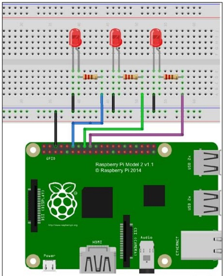

1. Make "hw4" directory and create python files named hw4_1.py and hw4_2.py, hw4_3.py ... in it if more than one problem are provided.
2. problem

    You need to write a python program for blinking LEDs as the following image shows 
    
    
    
    Your code should satisfy the three conditions:
    
    1. You should use OOP to define LED like the class definition on page 203 of textbook.
    2. You need to provide a menu for user to select which led to be opened or closed.
    3. You need to write a test code to ensure that your code is right.
  
