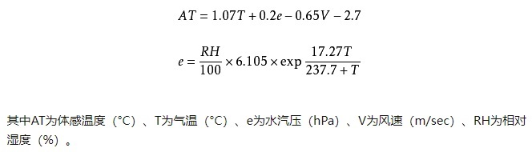

1. Make "hw6" directory and create python files named hw6_1.py and hw6_2.py, hw6_3.py ... in it if more than one problem are provided.
2. problems

    Listing 6-14 program can be used to communicate to the AM230x/DHT family of sensors to get temperature and humidity. For human beings, there is another kind of temperature: felt air temperature. Can you compute it based on the acquired temperature and humidity from the  AM230x/DHT sensor.     
You can program base on Listing 6-14, but you need to compare your results with the ones from Central Weather Bureau.

    For computation of felt air temperature, you can reference 'Robert G. Steadman, A universal scale of apparent temperature'. The equation is as the following:

